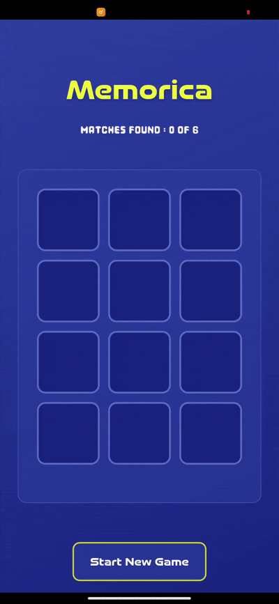

# 🎮 Memorica (Flutter + GetX)

A simple, fun, and interactive Memory Matching Game built using Flutter and GetX.
The objective is to test and improve memory skills by flipping and matching identical cards, complete with smooth animations, responsive UI, and game logic.

## 🕹️ Gameplay
  

## 🎯 Complete Game Mechanism
- Flip two cards
- Check match
- Lock matched cards
- Flip back mismatched cards
- Start new game

## 🧩 How It Works
1. Cards are generated in pairs
2. Cards are shuffled using an `RxList`
3. Each card has its own
    - Flip state
    - Animation controller
4. On flipping:
    - Card rotates
    - Icon scales smoothly
5. Game resets with new random card positions

## 🛠️ Tech Stack

- Flutter

- Dart

- GetX (State Management)


## Installation ⚡

1. Ensure Flutter is installed:
   ```bash
    flutter doctor
   ```

2. Clone the repository:
   ```bash
    git clone https://github.com/Sami0402/Memorica.git
   ```

3. Install dependencies:
   ```bash
    flutter pub get
   ```

4. Run the app:
   ```bash
    flutter run
   ```
 


